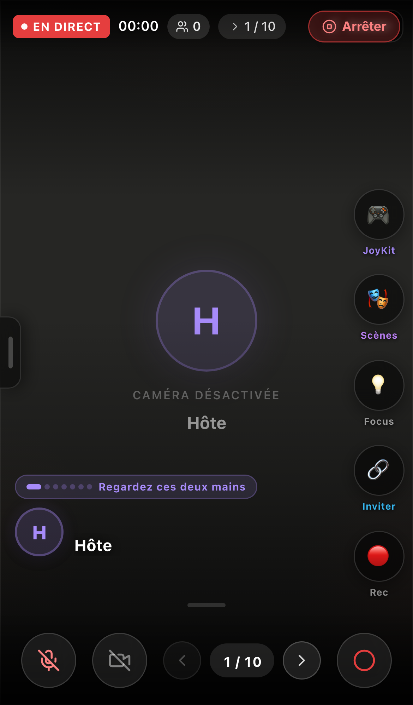

# Moteur de live hôte — MODÈLE OFFICIEL

> **Statut : modèle de référence officiel** pour l'interface du moteur de live (validé le 2026-06-06).
> Toute évolution / portage (natif `apps/mobile`, etc.) doit s'aligner sur cette interface.



C'est `LiveHostPage` rendue via la **coque mobile** `LiveHostMobileShell` : fond noir, smartboard
central, **tiroir gauche** (poignée à tirer au doigt), **rail d'actions à droite**, **drawer bas
type TikTok**, barre du bas. Toutes les options Liri (membres, chat, scènes, Q&R, IA…) vivent dans
les tiroirs — **rien n'est posé en dur sur l'écran d'accueil du live**.

---

## Comment le voir (preview, sans login)

```bash
cd apps/app
npm run dev            # Vite (par défaut http://localhost:5173)
```
Puis ouvrir, **en viewport mobile** (DevTools → device toolbar, ~375×812) :

```
http://localhost:5173/dev/liri-host-live
```

- Route dev **publique** (pas d'auth) — rend `<LiveHostPage />` via `DevLiriHostEntry`.
- En preview, les appels **Supabase / LiveKit** (non-localhost) sont bloqués → données vides :
  **smartboard vide** + « Caméra désactivée · preview » + « 0 membre ». C'est normal ;
  sur un vrai build/téléphone, les données se chargent.

### Routes réelles (avec auth + session)
- `/lives/:id/host`  (déclaré dans `apps/app/src/App.tsx`)
- `/live/host/:sessionId`  (déclaré dans `apps/app/src/App.jsx`)

---

## Fichiers (source de vérité)

| Rôle | Fichier |
|---|---|
| Page hôte (rend la coque sur mobile) | `apps/app/src/pages/LiveHostPage.jsx` (≈ L.1445 : `<LiveHostMobileShell …/>`) |
| **Coque mobile (racine)** | `apps/app/src/features/live/host/mobile/LiveHostMobileShell.jsx` |
| Entrée preview dev | `apps/app/src/pages/dev/DevLiriHostEntry.jsx` (clé `liri-host-live`) |

### Sous-composants de la coque
| Zone | Composant |
|---|---|
| Barre haute (EN DIRECT, timer, participants, slide n/10, Arrêter) | `LiveHostMobileTopBar.jsx` |
| Bande participants (haut) | `LiveHostMobileParticipantStrip.jsx` |
| Membre en plein écran | `LiveHostMobileMemberFullscreen.jsx` |
| Badges signal/réseau | `LiveHostMobileSignalBadges.jsx` |
| **Tiroir gauche** (poignée ▌) | `LiveHostMobileLeftDrawer.jsx` |
| **Rail d'actions droite** (FAB) | `LiveHostMobileFabStack.jsx` + `LiveHostMobileFabRail.jsx` |
| **Drawer bas (type TikTok)** | `LiveHostMobileDrawer.jsx` |
| Overlay chat | `LiveHostMobileChatOverlay.jsx` |
| Barre du bas (micro, caméra, nav slides, Rec) | `LiveHostMobileBottomBar.jsx` |
| Pipeline vidéo spectateur | `LiveHostMobileViewerPipeline.jsx` |
| Audio d'ambiance | `components/live-room/AmbientAudioLayer` |

---

## Disposition (schéma, repris du source `LiveHostMobileShell.jsx`)

```
┌─────────────────────────────────────────────┐
│  TopBar                     handle ▌ gauche  │
├──────────┬───────────────────┬──────────────┤
│ LeftDrawer│     SmartBoard    │   FabStack   │
│ (membres, │   (scène / slide) │ (actions →)  │
│  scènes…) │                   │              │
├──────────┴───────────────────┴──────────────┤
│            ═══ Drawer bas (TikTok) ═══        │
├─────────────────────────────────────────────┤
│                  BottomBar                    │
└─────────────────────────────────────────────┘
```

### Tiroir GAUCHE — `LiveHostMobileLeftDrawer`
Ouvert via la **poignée sur le bord gauche** (drag au doigt). Contenu :
- Compteur **« N membre(s) en ligne »** + liste membres
- Onglets/sections : **Scènes 🎭**, **Contrôle 🎛️**, **Signaux 🔔**, **Paramètres ⚙️**
- **Mode spotlight 💡** (met en valeur un participant)
- **Q&R NeuronQ ❓**
- **Levées de main ✋** (compteur)
- **Salle d'attente**

### Rail DROITE — `LiveHostMobileFabStack` / `LiveHostMobileFabRail`
Boutons d'action (drag/dépli) : **Chat 💬**, **Q&R ❓**, **Script 📄**, **IA ✨**,
**Scènes 🎬**, **Aparté**, **Inviter 👤+**. (Variantes vues en preview : JoyKit, Focus, Rec.)

### Centre — SmartBoard
La scène / slide en cours (vide tant qu'aucune scène n'est chargée — cf. preview).

### Bas — `LiveHostMobileBottomBar`
Micro · Caméra · navigation slides `‹ n/10 ›` · **Rec** (enregistrement).

---

## Design
- **Fond noir**, accents violets, UI plein écran (immersif).
- **Smartboard vide** par défaut tant qu'aucune scène/slide n'est poussée.
- Le **flux des membres** est **dans le tiroir gauche**, pas sur l'écran principal.
- Navigation tiroirs au **drag** (gauche/droite) + **drawer bas type TikTok**.

## À retenir pour le portage
Quand on portera le moteur de live en **natif (`apps/mobile`)**, c'est **cette interface**
(`LiveHostMobileShell`) qui sert de spécification — pas les variantes maquette
(`/m/eleve/live/maquette*`) ni l'empty-state `/dev/liri-host-ui`.
